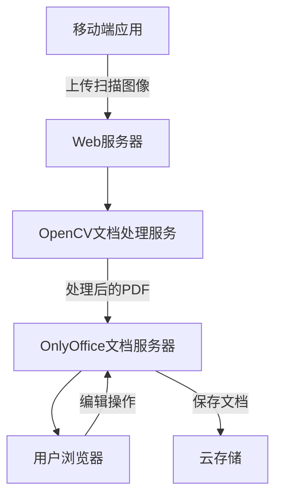

# OnlyOffice + OpenCV 文档扫描集成方案

## 方案概述
结合OnlyOffice文档编辑器与OpenCV-based文档扫描技术，创建一个完整的文档处理解决方案，支持从移动设备拍摄文档到PDF生成再到文档编辑的完整工作流。

## 系统架构

### 1. 整体架构图


### 2. 组件详细说明

#### 移动端应用 (Mobile App)
- **功能**: 文档拍摄、边缘检测、预览、上传
- **技术栈**: 
  - React Native + react-native-vision-camera
  - 或 Flutter + mlkit/flutter_document_scanner
  - 原生Android/iOS + OpenCV
- **核心功能**:
  - 实时文档边缘检测
  - 自动对焦和快门
  - 图像预览和编辑
  - 多页文档管理

#### Web服务器 (Backend Server)
- **功能**: API接口、文件管理、用户认证
- **技术栈**: Node.js/Express 或 Python/FastAPI
- **API端点**:
  - `POST /api/scan/upload` - 上传原始扫描图像
  - `POST /api/scan/process` - 触发OpenCV处理
  - `GET /api/scan/status/{id}` - 获取处理状态
  - `GET /api/documents/{id}` - 获取处理后的PDF

#### OpenCV文档处理服务
- **功能**: 图像处理、PDF生成
- **技术栈**: 
  - Python + OpenCV
  - 或 Node.js + opencv4nodejs
  - 或 WebAssembly + OpenCV.js
- **处理流程**:
  1. **边缘检测**: 使用Canny边缘检测和轮廓分析
  2. **透视校正**: 计算透视变换矩阵并应用
  3. **图像增强**: 调整亮度、对比度、去噪
  4. **PDF生成**: 将处理后的图像转换为PDF
  5. **OCR处理** (可选): 使用Tesseract进行文本识别

#### OnlyOffice集成层
- **功能**: 文档编辑、协作、存储
- **集成方式**:
  - **插件方式**: 开发OnlyOffice插件，提供扫描功能入口
  - **独立页面**: 创建独立的扫描页面，处理完成后跳转到OnlyOffice
  - **API集成**: 通过OnlyOffice Document Builder API直接操作文档

## 技术实现细节

### 1. OpenCV文档扫描算法

#### 边缘检测和轮廓提取
```python
# Python伪代码示例
import cv2
import numpy as np

def detect_document_edges(image):
    # 转换为灰度图
    gray = cv2.cvtColor(image, cv2.COLOR_BGR2GRAY)
    
    # 高斯模糊去噪
    blurred = cv2.GaussianBlur(gray, (5, 5), 0)
    
    # Canny边缘检测
    edges = cv2.Canny(blurred, 75, 200)
    
    # 轮廓检测
    contours, _ = cv2.findContours(edges.copy(), cv2.RETR_LIST, cv2.CHAIN_APPROX_SIMPLE)
    contours = sorted(contours, key=cv2.contourArea, reverse=True)[:5]
    
    # 寻找四边形轮廓
    for contour in contours:
        peri = cv2.arcLength(contour, True)
        approx = cv2.approxPolyDP(contour, 0.02 * peri, True)
        if len(approx) == 4:
            return approx
    
    return None
```

#### 透视校正
```python
def perspective_transform(image, pts):
    # 计算目标矩形的尺寸
    rect = order_points(pts)
    (tl, tr, br, bl) = rect
    
    widthA = np.sqrt(((br[0] - bl[0]) ** 2) + ((br[1] - bl[1]) ** 2))
    widthB = np.sqrt(((tr[0] - tl[0]) ** 2) + ((tr[1] - tl[1]) ** 2))
    maxWidth = max(int(widthA), int(widthB))
    
    heightA = np.sqrt(((tr[0] - br[0]) ** 2) + ((tr[1] - br[1]) ** 2))
    heightB = np.sqrt(((tl[0] - bl[0]) ** 2) + ((tl[1] - bl[1]) ** 2))
    maxHeight = max(int(heightA), int(heightB))
    
    # 目标点
    dst = np.array([
        [0, 0],
        [maxWidth - 1, 0],
        [maxWidth - 1, maxHeight - 1],
        [0, maxHeight - 1]], dtype="float32")
    
    # 计算透视变换矩阵
    M = cv2.getPerspectiveTransform(rect, dst)
    warped = cv2.warpPerspective(image, M, (maxWidth, maxHeight))
    
    return warped
```

### 2. OnlyOffice插件开发

#### 插件结构
```
onlyoffice-scanner-plugin/
├── config.json
├── plugin.xml
├── code.js
├── translations/
│   └── en-US.json
└── icons/
    └── icon.png
```

#### 插件配置 (config.json)
```json
{
  "name": "Document Scanner",
  "description": "Scan documents using mobile camera and convert to PDF",
  "url": "https://your-server.com/scanner",
  "icons": ["icon.png"],
  "isViewer": false,
  "isEditor": true,
  "isEmbedded": false
}
```

#### 插件逻辑 (code.js)
```javascript
// OnlyOffice插件入口
window.Asc.plugin.init = function() {
    // 显示扫描界面
    showScannerInterface();
};

function showScannerInterface() {
    // 创建扫描界面HTML
    const html = `
        <div id="scanner-container">
            <h3>文档扫描</h3>
            <button id="start-scan">开始扫描</button>
            <div id="preview"></div>
            <button id="upload-btn" disabled>上传到编辑器</button>
        </div>
    `;
    
    window.Asc.plugin.executeMethod("AddHtml", [html]);
    
    // 绑定事件
    document.getElementById('start-scan').addEventListener('click', startScanning);
    document.getElementById('upload-btn').addEventListener('click', uploadToEditor);
}

function startScanning() {
    // 跳转到移动扫描页面
    const scanUrl = 'https://your-server.com/mobile-scanner';
    window.open(scanUrl, '_blank');
}

function uploadToEditor() {
    // 从服务器获取处理后的PDF并插入到文档中
    fetch('/api/scan/latest-pdf')
        .then(response => response.blob())
        .then(pdfBlob => {
            // 将PDF插入到OnlyOffice文档中
            window.Asc.plugin.executeMethod("InsertFromFile", [pdfBlob]);
        });
}
```

### 3. 移动端实现方案

#### React Native方案
```javascript
// 使用react-native-vision-camera和opencv
import { useCameraDevice, useCameraFormat, Camera } from 'react-native-vision-camera';
import { EdgeDetectionView } from './EdgeDetectionView';

const DocumentScanner = () => {
  const device = useCameraDevice('back');
  const format = useCameraFormat(device, {
    photoAspectRatio: 4/3,
    videoResolution: { width: 1920, height: 1080 }
  });

  const takePhoto = async () => {
    if (camera.current) {
      const photo = await camera.current.takePhoto({
        qualityPrioritization: 'quality',
        flash: 'auto'
      });
      
      // 发送到OpenCV处理服务
      await processDocument(photo.path);
    }
  };

  return (
    <Camera
      ref={camera}
      device={device}
      format={format}
      isActive={true}
      photo={true}
    >
      <EdgeDetectionView />
      <TouchableOpacity onPress={takePhoto}>
        <Text>拍照</Text>
      </TouchableOpacity>
    </Camera>
  );
};
```

## 部署架构

### 开发环境
- **OnlyOffice**: Docker容器部署
- **OpenCV服务**: Python Flask应用
- **Web服务器**: Node.js/Express
- **数据库**: PostgreSQL/MySQL

### 生产环境
- **负载均衡**: Nginx
- **容器化**: Docker + Kubernetes
- **缓存**: Redis
- **存储**: AWS S3/阿里云OSS

## 开发步骤

### 第一阶段：基础功能验证
1. 搭建OnlyOffice开发环境
2. 实现基本的OpenCV文档扫描算法
3. 创建简单的移动端原型
4. 验证端到端工作流

### 第二阶段：功能完善
1. 开发完整的OnlyOffice插件
2. 实现移动端生产级应用
3. 添加多页文档支持
4. 集成OCR功能

### 第三阶段：优化和部署
1. 性能优化（图像处理速度、内存使用）
2. 用户体验优化
3. 安全性加固
4. 生产环境部署

## 技术挑战和解决方案

### 1. 移动端性能
- **挑战**: OpenCV在移动端运行性能问题
- **解决方案**: 
  - 使用原生OpenCV库而非JavaScript版本
  - 优化算法，减少不必要的计算
  - 异步处理，避免UI阻塞

### 2. OnlyOffice集成复杂性
- **挑战**: OnlyOffice插件API限制
- **解决方案**:
  - 采用混合集成方式（插件+独立页面）
  - 利用OnlyOffice的外部存储API
  - 通过WebSocket实现实时通信

### 3. 跨平台兼容性
- **挑战**: 不同设备和浏览器的兼容性
- **解决方案**:
  - 使用标准化的Web API
  - 渐进式增强设计
  - 充分的测试覆盖

## 预期成果

1. **完整的文档扫描解决方案**
2. **与OnlyOffice无缝集成的用户体验**
3. **支持多平台的移动端应用**
4. **可扩展的微服务架构**
5. **开源的代码库和文档**

这个方案结合了OnlyOffice的强大文档编辑能力和OpenCV的先进图像处理技术，能够满足您对类似WPS文档扫描功能的需求。